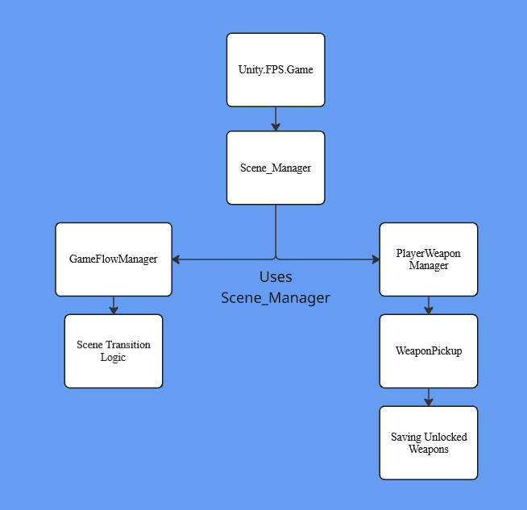

Game Engine Design And Implementation: Lab Assignment #1
Student: 100969833: Owen Brandon
Title: Fighting For Oblivion
Gameplay Loop: Defeat all enemies in the level to progress. Complete all levels to win.

Project Diagram (Singleton): 

- What element of your game adopts the chosen pattern?
    - Handling scene transitions between levels while retaining all data through one instance starting from Runtime.

- Why is this pattern a good choice for the associated functionality?
    - A Singleton is perfect for managing scene changing between requests as it allows for more simplicity when changing scenes and lets the game function without worrying about which scene to transition to.
        - For example, heading to main Menu from any point requires a simple method call. Scene_Manager.Instance.LoadMainMenu();
        - Or loading the next level. Simply call Scene_Manager.Instance.LoadNextLevel(); All of the calculations and wrapping is done within the Scene_Manager(Singleton) script.

External Assets

    - Unity Technologies. FPS Microgame. Version 2.0.0, Unity Asset Store, 2020, assetstore.unity.com/packages/templates/fps-microgame-163276.
       
        *The Asset Store link doesn't work and I can't find any other reference links to the project. They are template downloads within the Unity Hub Launcher*

Links to scripts
- Scene_Manager
    - https://github.com/Bowen9221/GameEngine_LabAssignment_1/blob/main/My%20project/Assets/FPS/Scripts/Gameplay/Scene_Manager.cs

- Singleton
    - https://github.com/Bowen9221/GameEngine_LabAssignment_1/blob/main/My%20project/Assets/FPS/Scripts/Gameplay/Singleton.cs